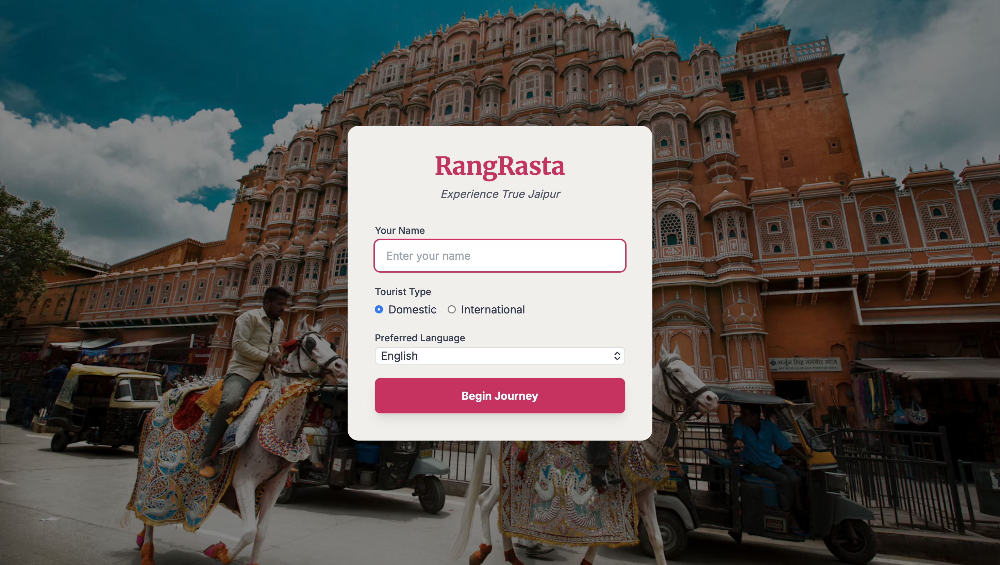

# Rang Rasta :)

*Experience True Jaipur*

A web app for people visiting Jaipur for the first time. It puts the things a tourist
usually has to hunt for across five different sites into one place.

Live demo: https://rang-rasta-dmdv.onrender.com

(It runs on a free server that sleeps when nobody's using it, so the first load can
take up to a minute. After that it's quick.)

## why i made this

Finding basic information about Jaipur shouldn't take five different websites. I
built Rang Rasta to put it all in one place, and to learn how a full app fits
together while I was at it, from the Express backend to the React frontend.

## what it does

~ lists 23 places (forts, temples, museums, bazaars, food spots, parks and more) with hours, entry fees and the best time to visit  
~ has a festival and event list, plus a month-by-month city calendar  
~ gives a short history of Jaipur  
~ has a tour planner: pick your days, budget, pace and interests, and it builds an itinerary  
~ lets you save your itineraries once you've logged in  
~ covers ticket bookings and travel and hotel guidance  
~ has an SOS button, helpline numbers and tourist police info  
~ has a contact form for the tourism office  
~ asks at login whether you're a domestic or international traveller, and which language you prefer  

## built with

React (loaded through a CDN, so no build step) for the frontend, Node.js and Express
for the backend, a JSON file for storage, and Jest and Supertest for tests. One server
handles both the website and the API.

## design notes

The colours come from Jaipur's Pink City look. I kept the SOS option easy to
reach because it's the one feature nobody should have to search for. Every place gets
its own generated card art (a gradient and an icon) instead of stock photos, so
nothing reuses another place's picture.

The tour planner is rule-based, not real AI. It filters places by your interests and
budget, then ranks them by rating.

## what's not finished

Login has no passwords, so anyone can sign up with just a name. That's fine for a demo
but not for anything sensitive. Data lives in a plain JSON file, which resets whenever
the free server restarts. The language you pick at login doesn't translate the site yet.

## next on my list

~ make the language switch really work (English and Hindi first)  
~ add a map with all the attractions pinned  
~ move from the JSON file to a real database (SQLite or Postgres)  
~ add proper login with hashed passwords  

## run it yourself

You need Node.js 16 or later.

    git clone https://github.com/ineek808/rang-rasta.git
    cd rang-rasta
    npm install
    cp .env.example .env
    npm start

Then open http://localhost:3000. One server does everything.

The `.env` file takes two settings:

    PORT             the port the server runs on (default 3000)
    ALLOWED_ORIGIN   the one origin CORS allows (default http://localhost:3000)

To run the tests:

    npm test

## license

MIT. See [LICENSE](./LICENSE).
